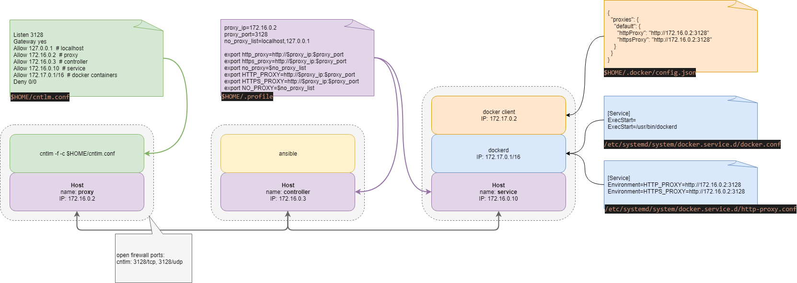

# Test Ansible role behaviour behind a proxy

## Introduction

This project was created to understand how to configure hosts which may be behind a proxy and have a firewall set to run Ansible unmodified roles. Not needed to modify the roles allows Ansible Galazy role to be utilised directly, reducing the maintence overhead of maintaining a large number of roles. A second, objective is to utilise a single proxy instance in order to reduce the riks associated with running multiple password protected proxies. The type of topololgy which is therefore utilised is shown in the following figure.



In order to allow Ansible roles to be utilised behind a proxy Ansible requires the following environment variables to be defined:

| variable    | used by         |
| ----------- | --------------- |
| http_proxy  | pkg_mgr, docker |
| https_proxy | pkg_mgr, docker |
| no_proxy    | pkg_mgr, docker |
| HTTP_PROXY  | pip             |
| HTTPS_PROXY | pip             |
| NO_PROXY    | pip             |

Ansible uses the following different apporaches to get environment varialbes from the controller and remote nodes.

The Ansible [env lookup](https://docs.ansible.com/ansible/latest/plugins/lookup/env.html) plugin allows the query of environment variables on the controller, for example

```
http_proxy: "{{ lookup('env', 'http_proxy') | default(omit) }}"
```

To return the equivalent variable on a remote node, use

```
http_proxy: "{{ ansible_env.http_proxy | default(omit) }}"
```

## Instructions

Copy the example Ansible inventory file [`hosts-example.yml`](hosts-example.yml) to `hosts.yml` and set the relevant IP addresses for the `proxy-node` and `remote-node`.

Need to set the following environment proxy variables, as external IP addresses, on each host file `$HOME/.profile`, for example:

```bash
proxy_ip=172.16.0.100
proxy_port=3128
no_proxy_list=localhost,127.0.0.1
export http_proxy=http://$proxy_ip:$proxy_port
export https_proxy=http://$proxy_ip:$proxy_port
export no_proxy=$no_proxy_list
export HTTP_PROXY=http://$proxy_ip:$proxy_port
export HTTPS_PROXY=http://$proxy_ip:$proxy_port
export NO_PROXY=$no_proxy_list
```

```tcsh
set proxy_ip=172.16.0.100
set proxy_port=3128
set no_proxy_list=localhost,127.0.0.1
setenv http_proxy http://$proxy_ip:$proxy_port
setenv https_proxy http://$proxy_ip:$proxy_port
setenv no_proxy $no_proxy_list
setenv HTTP_PROXY http://$proxy_ip:$proxy_port
setenv HTTPS_PROXY http://$proxy_ip:$proxy_port
setenv NO_PROXY $no_proxy_list
```

Copy the example Ansible inventory file [`hosts-example.yml`](hosts-example.yml) to `hosts.yml` and set the relevant IP addresses for the `proxy-node` and `remote-node`.

Run the play using the script [`./run_play.sh`](run_play.sh).

## Test

To test within a Docker container, use an Alpine container on the remote host, for example

```sh
docker pull alpine:latest
docker run -it alpine:latest
```

Within the container, test external access using

```sh
wget http://www.google.com
```

## Sources:

* https://docs.ansible.com/ansible/latest/user_guide/playbooks_environment.html
* https://docs.docker.com/network/proxy/
* https://medium.com/@saniaky/configure-docker-to-use-a-host-proxy-e88bd988c0aa
